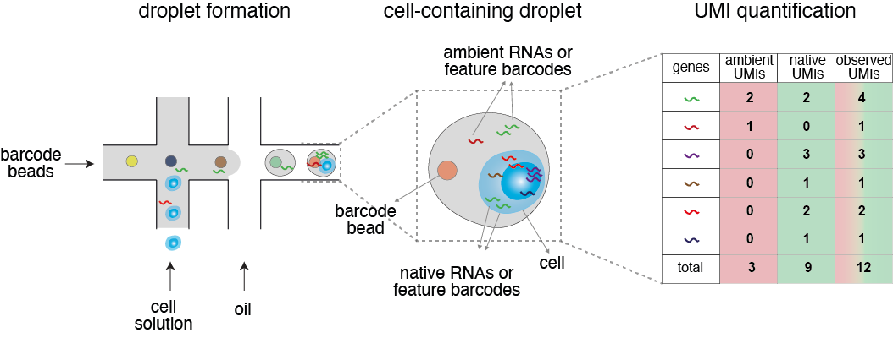

Introduction
===============

What is ambient signal?
~~~~~~~~~~~~~~~~~~~~~~~~~~~~~~

|

|

During the preparation of the single-cell solution, RNA or protein counts are released upon cell lysis and consequently encapsulated by droplets. These exogenous molecules are mixed with native ones and barcoded by the same 10x bead, resulting in overestimated count data.

|
The design of scAR
~~~~~~~~~~~~~~~~~~~~~~~~~~~~~~
|
.. image:: img/overview_scAR.png
   :width: 600
   :align: center
|

scAR uses a latent variable model to represent the biological and technical components in the observed count data. scAR is built under ambient signal hypothesis, in which the probability of occurrence of each ambient transcript can be empirically estimated from cell-free droplets. There are two hidden variables, contamination level per cell and the probability of occurrence of native transcript. With these three parameters, we are able to reconstruct the noisy observations. To learn the hidden variables, we train neural networks (the variational autoencoder) to minimize the differences between the reconstructions and original noisy observations. Once converging, the contamination levels and native expression are inferred and downstream analysis can be performed using these values.

|
What types of data that scAR can process?
~~~~~~~~~~~~~~~~~~~~~~~~~~~~~~~~~~~~~~~~~~~~~~~~~~~~~~~

We applied scAR to scRNAseq data for denoising mRNA, scCRISPRseq data for sgRNA assignment, and CITE-seq data for denoising protein counts (ADT). In theory, any droplet-based single-cell omics technology has the ambient signal contamination issue, and scAR can be a good consideration.
