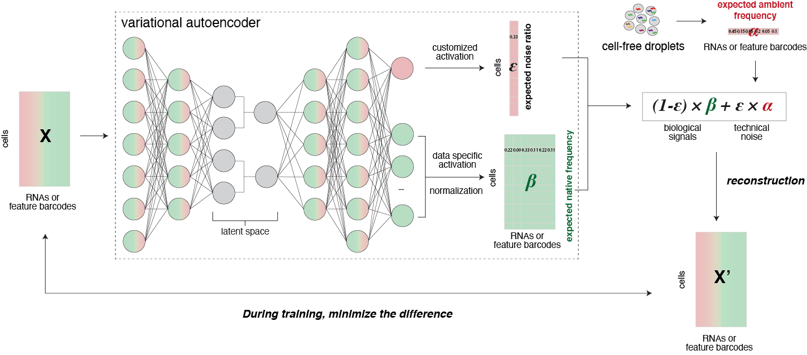

.. scAR documentation master file, created by
   sphinx-quickstart on Fri Apr 22 15:48:44 2022.
   You can adapt this file completely to your liking, but it should at least
   contain the root `toctree` directive.

Welcome to scAR's documentation!
================================

**scAR** (single-cell Ambient Remover) is a package for denoising multiple single cell omics data. It can be used for multiple tasks, such as, sgRNA assignment for scCRISPRseq, identity barcode assignment for cell indexing, protein denoising for CITE-seq, mRNA denoising for scRNAseq, and etc.. It is built using probabilistic deep learning, illustrated as follows:

.. toctree::
   :maxdepth: 2
   
   Installation
   Tutorials
   tutorials/*.ipynb
   scAR_tutorial_sgRNA_assignment.ipynb